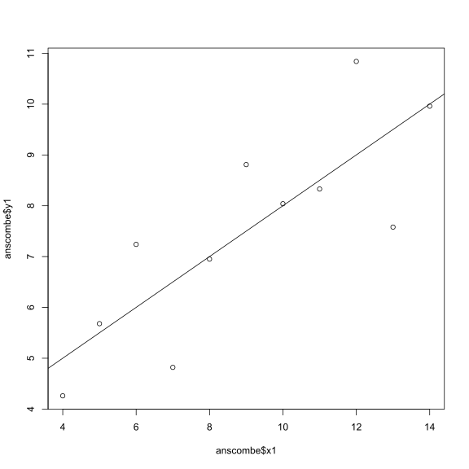

Hello Octocat
-------------

I love Octocat. She's the coolest cat in town.

\`

    data("anscombe")
    dim.data.frame(anscombe)

    ## [1] 11  8

    colnames(anscombe)

    ## [1] "x1" "x2" "x3" "x4" "y1" "y2" "y3" "y4"

    head(anscombe)

    ##   x1 x2 x3 x4   y1   y2    y3   y4
    ## 1 10 10 10  8 8.04 9.14  7.46 6.58
    ## 2  8  8  8  8 6.95 8.14  6.77 5.76
    ## 3 13 13 13  8 7.58 8.74 12.74 7.71
    ## 4  9  9  9  8 8.81 8.77  7.11 8.84
    ## 5 11 11 11  8 8.33 9.26  7.81 8.47
    ## 6 14 14 14  8 9.96 8.10  8.84 7.04

    tail(anscombe)

    ##    x1 x2 x3 x4    y1   y2   y3    y4
    ## 6  14 14 14  8  9.96 8.10 8.84  7.04
    ## 7   6  6  6  8  7.24 6.13 6.08  5.25
    ## 8   4  4  4 19  4.26 3.10 5.39 12.50
    ## 9  12 12 12  8 10.84 9.13 8.15  5.56
    ## 10  7  7  7  8  4.82 7.26 6.42  7.91
    ## 11  5  5  5  8  5.68 4.74 5.73  6.89

    summary(anscombe)

    ##        x1             x2             x3             x4    
    ##  Min.   : 4.0   Min.   : 4.0   Min.   : 4.0   Min.   : 8  
    ##  1st Qu.: 6.5   1st Qu.: 6.5   1st Qu.: 6.5   1st Qu.: 8  
    ##  Median : 9.0   Median : 9.0   Median : 9.0   Median : 8  
    ##  Mean   : 9.0   Mean   : 9.0   Mean   : 9.0   Mean   : 9  
    ##  3rd Qu.:11.5   3rd Qu.:11.5   3rd Qu.:11.5   3rd Qu.: 8  
    ##  Max.   :14.0   Max.   :14.0   Max.   :14.0   Max.   :19  
    ##        y1               y2              y3              y4        
    ##  Min.   : 4.260   Min.   :3.100   Min.   : 5.39   Min.   : 5.250  
    ##  1st Qu.: 6.315   1st Qu.:6.695   1st Qu.: 6.25   1st Qu.: 6.170  
    ##  Median : 7.580   Median :8.140   Median : 7.11   Median : 7.040  
    ##  Mean   : 7.501   Mean   :7.501   Mean   : 7.50   Mean   : 7.501  
    ##  3rd Qu.: 8.570   3rd Qu.:8.950   3rd Qu.: 7.98   3rd Qu.: 8.190  
    ##  Max.   :10.840   Max.   :9.260   Max.   :12.74   Max.   :12.500

    library(readr)
    df<-data.frame(read.csv("analgesic.csv",header=T))
    df

    ##    ID     Group Measurement_1 Measurement_2 Measurement_3
    ## 1   1 Analgesic            26            26            21
    ## 2   2 Analgesic            29            26            23
    ## 3   3 Analgesic            24            28            22
    ## 4   4 Analgesic            25            22            24
    ## 5   5 Analgesic            24            28            23
    ## 6   6 Analgesic            22            23            26
    ## 7   7 Analgesic            25            25            30
    ## 8   8 Analgesic            28            21            21
    ## 9   9 Analgesic            22            26            20
    ## 10 10 Analgesic            18            25            29
    ## 11 11 Analgesic            25            29            28
    ## 12 12 Analgesic            26            25            23
    ## 13 13 Analgesic            26            25            26
    ## 14 14 Analgesic            19            30            27
    ## 15 15 Analgesic            24            20            24
    ## 16 16 Analgesic            23            24            27
    ## 17 17 Analgesic            24            32            28
    ## 18 18 Analgesic            24            17            25
    ## 19 19 Analgesic            23            25            23
    ## 20 20 Analgesic            30            18            25
    ## 21 21   Placebo            19            12            18
    ## 22 22   Placebo            10            16            18
    ## 23 23   Placebo            12            11            20
    ## 24 24   Placebo            17            17            18
    ## 25 25   Placebo            18            18            20
    ## 26 26   Placebo            12            16            16
    ## 27 27   Placebo            14            17            17
    ## 28 28   Placebo            20            19            18
    ## 29 29   Placebo            16            19            15
    ## 30 30   Placebo            17            15            13
    ## 31 31   Placebo            18            21            14
    ## 32 32   Placebo            20            13            16
    ## 33 33   Placebo            12             8            21
    ## 34 34   Placebo            20            17            16
    ## 35 35   Placebo            17            21            15
    ## 36 36   Placebo            19            17            15
    ## 37 37   Placebo            14            19            13
    ## 38 38   Placebo            17            19            13
    ## 39 39   Placebo            11            20            18
    ## 40 40   Placebo            15            18            12

    dim(df)

    ## [1] 40  5

    colnames(df)

    ## [1] "ID"            "Group"         "Measurement_1" "Measurement_2"
    ## [5] "Measurement_3"

    head(df)

    ##   ID     Group Measurement_1 Measurement_2 Measurement_3
    ## 1  1 Analgesic            26            26            21
    ## 2  2 Analgesic            29            26            23
    ## 3  3 Analgesic            24            28            22
    ## 4  4 Analgesic            25            22            24
    ## 5  5 Analgesic            24            28            23
    ## 6  6 Analgesic            22            23            26

    tail(df)

    ##    ID   Group Measurement_1 Measurement_2 Measurement_3
    ## 35 35 Placebo            17            21            15
    ## 36 36 Placebo            19            17            15
    ## 37 37 Placebo            14            19            13
    ## 38 38 Placebo            17            19            13
    ## 39 39 Placebo            11            20            18
    ## 40 40 Placebo            15            18            12

    summary(df)

    ##        ID              Group    Measurement_1   Measurement_2 
    ##  Min.   : 1.00   Analgesic:20   Min.   :10.00   Min.   : 8.0  
    ##  1st Qu.:10.75   Placebo  :20   1st Qu.:17.00   1st Qu.:17.0  
    ##  Median :20.50                  Median :20.00   Median :20.0  
    ##  Mean   :20.50                  Mean   :20.12   Mean   :20.7  
    ##  3rd Qu.:30.25                  3rd Qu.:24.00   3rd Qu.:25.0  
    ##  Max.   :40.00                  Max.   :30.00   Max.   :32.0  
    ##  Measurement_3  
    ##  Min.   :12.00  
    ##  1st Qu.:16.00  
    ##  Median :20.50  
    ##  Mean   :20.52  
    ##  3rd Qu.:24.25  
    ##  Max.   :30.00

    library(dplyr)

    ## 
    ## Attaching package: 'dplyr'

    ## The following objects are masked from 'package:stats':
    ## 
    ##     filter, lag

    ## The following objects are masked from 'package:base':
    ## 
    ##     intersect, setdiff, setequal, union

    library(tidyr)
